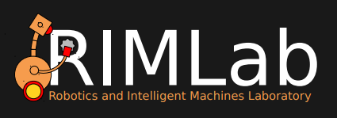
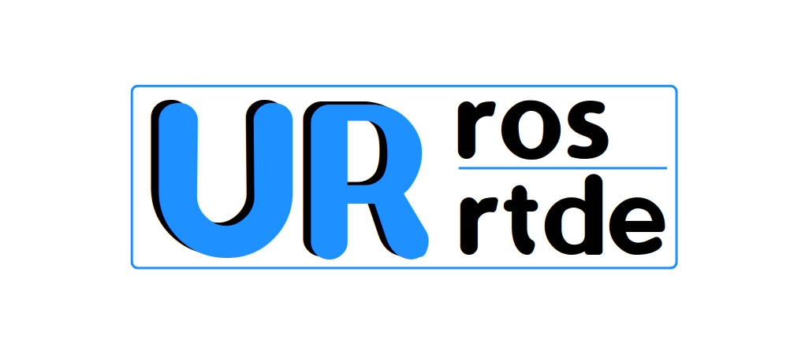

# ROS2 Interface for Universal Robot CoBots Control with ur_rtde (C++, Python)


<div style="display: flex; justify-content: center;">
    
    
</div>

</br>

ROS2 interfaces based on [ur_rtde](https://gitlab.com/sdurobotics/ur_rtde) for communication with **Universal Robot collaborative manipulators**. 
The software was developed within [RIMLab](https://rimlab.ce.unipr.it/), the robotic laboratory of the University of Parma. 

This project is currently under development, with ongoing updates and enhancements planned for the future. If you have any thoughts or feedback about the software, feel free to contact us at alessio.saccuti@unipr.it.

---

## Capabilities of `ur_ros_rtde`
- Reception of various data including joint positions, force, torque, etc.
- Configuration of internal robot parameters such as payload.
- UR control box digital pin reading and writing.
- Execution of MovePath, MoveJ, and MoveL commands.
- Execution of MoveL commands until contact is detected.
- Execution of MoveL commands until force or torque exceeds predefined thresholds.
- Sending and executing trajectories in the joint state space (e.g., trajectories planned with MoveIt!).
- Control of Schmalz GCPi vacuum gripper and OnRobot Soft Gripper (SG).
- Possibility of using ROS2 interfaces in simulated environments, even in the absence of physical hardware (e.g., trajectory evaluation).
- Possibility of using ROS2 interfaces along with MoveIt! configuration packages.
- Visualization of the 3D robot in RViz.

<p align="center">
  
</p>

---

## Contents of `ur_ros_rtde`
- `ur_ros_rtde`: the core of our software, ROS2 nodes which provides messages on topics, services and actions.
- `ur_ros_rtde_msgs`: messages, services and actions definitions.
- `ur_ros_rtde_simple_clients`: utility header files for services and actions.
- `simple_ur10e_description`: example of description package containing meshes, xacro and urdf files. The package is a simplified version of [this repository](https://github.com/UniversalRobots/Universal_Robots_ROS2_Description), but specific for UR10e.
- `simple_ur10e_moveit_config`: example of MoveIt! configuration package generated with `moveit_setup_assistant`.

---
## Setup `ur_ros_rtde`

To utilize our software, you need to install `ur_rtde` and `ROS2`.

### Install `ur_rtde`:

  You can install `ur_rtde` via `pip` by running: 
  ```bash
  pip3 install ur_rtde
  ```

  Alternatively, you can manually build it:

  ```bash
  git clone https://gitlab.com/sdurobotics/ur_rtde.git
  cd ur_rtde
  git submodule update --init --recursive
  mkdir build
  cd build
  cmake ..
  make 
  sudo make install
  ```

### Install Robot Operating System 2 (`ROS2`)

We recommend installing ROS2 **humble** using the official [guide](https://docs.ros.org/en/humble/Installation/Ubuntu-Install-Debians.html).

Additionally, install the following packages:
  ```bash
  sudo apt install python3-colcon-common-extensions
  sudo apt-get install ros-humble-controller-manager
  ```

(Optional) Install **MoveIt!**:

`ur_ros_rtde` ROS2 nodes were developed so that `MoveIt!` can be easily adopted for motion planning.

  ```bash
  sudo apt install ros-humble-moveit
  sudo apt install ros-$ROS_DISTRO-rmw-cyclonedds-cpp
  echo "export RMW_IMPLEMENTATION=rmw_cyclonedds_cpp" >> ~/.bashrc
  echo "export LC_NUMERIC=en_US.UTF-8" >> ~/.bashrc
  ```

### Setup ROS2 interfaces
```bash
# clone ur_ros_rtde repository
git clone https://github.com/SuperDiodo/ur_ros_rtde.git

# build ur_ros_rtde_msgs
colcon build --symlink-install --cmake-args -DCMAKE_BUILD_TYPE=Release --packages-select ur_ros_rtde_msgs

# build ur_ros_rtde_simple_clients
colcon build --symlink-install --cmake-args -DCMAKE_BUILD_TYPE=Release --packages-select ur_ros_rtde_simple_clients

# build ur_ros_rtde
colcon build --symlink-install --cmake-args -DCMAKE_BUILD_TYPE=Release --packages-select ur_ros_rtde

(Optional)

# build simple_ur10e_description, i.e. ur10e meshes and xacro files
colcon build --symlink-install --cmake-args -DCMAKE_BUILD_TYPE=Release --packages-select simple_ur10e_description

# build simple_ur10e_moveit_config, i.e. configuration pkg for MoveIt!
colcon build --symlink-install --cmake-args -DCMAKE_BUILD_TYPE=Release --packages-select simple_ur10e_moveit_config
```
---
## How to use `ur_ros_rtde`

Our software is composed of two ROS2 nodes:

**robot_state_receiver**: provides robot data through topics and services (reference launch file: `robot_state_receiver.launch.py`).

**command_server**: offers ROS2 action servers for robot control (reference launch file: `command_server.launch.py`)

You can easily interact with ROS2 services and actions using header files provided in `ur_ros_rtde_simple_clients`.
For further details and documentation, please visit [`ur_ros_rtde`](https://github.com/SuperDiodo/ur_ros_rtde/tree/main/ur_ros_rtde).


Test if everything is working:

1. Ensure that `simple_ur10e_description` is compiled and then generate UR10e urdf file from xacro files.
    ```bash
    # generate ur10e urdf
    cd ~/your_path/simple_ur10e_description/urdf
    sh generate_urdf.sh ur10e.xacro ur10e.urdf
    ```

2. Configure `robot_state_receiver.launch.py`:
    - set ip address with `robot_ip`
    - set `robot_description_package = "simple_ur10e_description"`
    - set `urdf_file_name = "urdf/ur10e.urdf"`
    - (optional) set `launch_rviz = True` if robot should be displayed in RViz

3. Launch **robot_state_receiver**:
    ```bash
    # type in a new terminal
    ros2 launch ur_ros_rtde robot_state_receiver.launch.py
    ```
4. Configure `command_server.launch.py` setting ip address with `robot_ip`
5. Launch **command_server**:
    ```bash
    # type in a new terminal
    ros2 launch ur_ros_rtde command_server.launch.py
    ```
6. Run test:

    **WARNING**! If everything was successfully configured the robot will start moving! Check for possible collisions with the environment!
    
    With `test_command_server` executable MoveL commands are sent to the robot. Starting from the actual pose it will move +10 cm on X axis, then -20 cm on X axis and finally +10 on X axis again.

    ```bash
    # type in a new terminal
    ros2 run ur_ros_rtde test_command_server
    ```

    Moreover, there is a second executable (`test_trajectory_execution`) which can be used to test trajectory execution.
    The robot will move as shown in the animated image (the robot is oriented towards Y-axis).

    <p align="center">
      
    </p>

    ```bash
    # type in a new terminal
    ros2 run ur_ros_rtde test_trajectory_execution
    ```

---
## Integration of `ur_ros_rtde` and MoveIt!

Setting `launch_moveit = True` in `ur_ros_rtde/launch/robot_state_receiver.launch.py`, several files from the associated MoveIt! configuration packages are automatically launched. 

We recommend to use [`moveit_planning`](https://github.com/SuperDiodo/moveit_planning.git), a C++ library which includes utility functions for using ROS2 MoveIt! planning framework.

In `moveit_planning` instructions on the setup and its usage can be found.